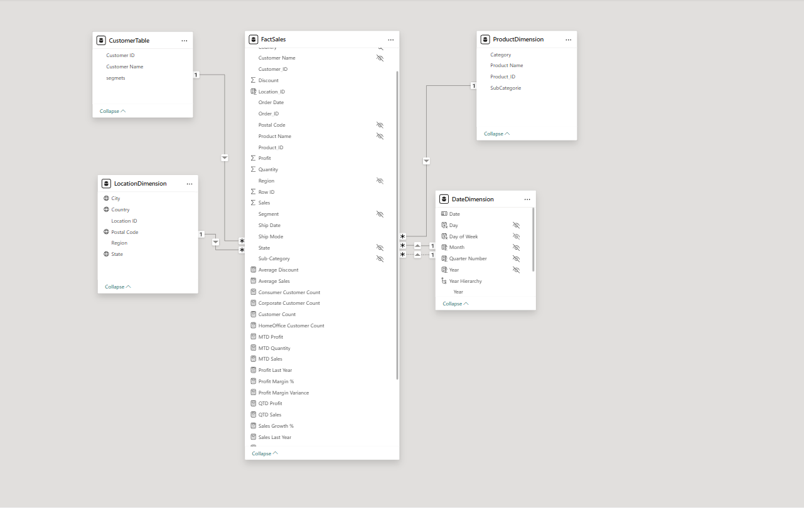
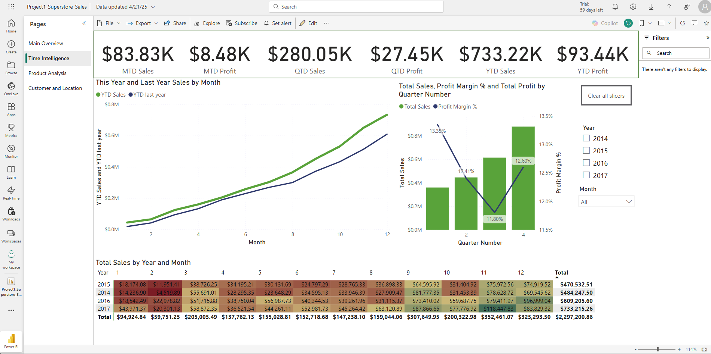
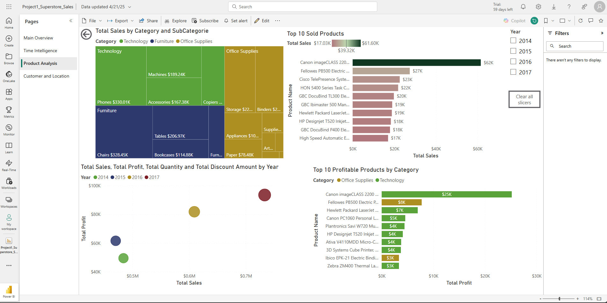

# Superstore Sales Analysis Dashboard


## 🚀 Live Report

🔗 **[View live on Power BI Service](https://app.powerbi.com/view?r=eyJrIjoiYmNiNjE2NWEtNmIwMC00MDZkLWIyMTEtZjRhNTkxYmM2ZDI3IiwidCI6ImIyZDQ1OTA3LTUwOWItNDQ5Ni05YmQzLTVhNjBjN2YwZjM4MCIsImMiOjN9)**

**GitHub Repo**: https://github.com/AdamKhemiri/superstore-sales-pbi

---

## 📂 Data Source & Profiling

- **Source**: [Kaggle Superstore Sales (2014–2017)](https://www.kaggle.com/datasets/vivek468/superstore-dataset-final/data)  
- **Raw CSV**: 999,996 rows × 21 columns  
- **Profiling & Cleanup**  
  - Row ID primary key: 100% unique, no blanks  
  - Quantity, Discount, Profit: no nulls  
  - Removed unused columns; standardized data types (dates, numerics)  
  - Formatted all dates as MM/DD/YYYY

---

## 📐 Data Model



*Star‑schema with one fact table (FactSales) connected to five dimensions (Date, Customer, Product, Location).*


## 🧮 Key DAX Measures

See [measure-formulas/DAX-measures.md](measure-formulas/DAX-measures.md) for full definitions:

- **Total Sales** = `SUM(FactSales[Sales])`  
- **Total Profit** = `SUM(FactSales[Profit])`  
- **Total Quantity** = `SUM(FactSales[Quantity])`  
- **Average Sales**, **Average Discount**  
- **MTD / QTD / YTD** metrics (Sales, Profit, Quantity)  
- **Year‑over‑Year** (Sales Last Year, Profit Last Year, Growth %)  
- **Customer Counts** by Segment (Consumer, Corporate, Home Office)  
- **Profit Margin** & **Margin Variance**  
- **Total Discount Amount** = `SUMX(FactSales, Sales * Discount)`

---

## 📈 Report Pages & Screenshots

1. **Main Overview**  
   - KPI Cards: Total Sales, Profit, Quantity  
   - Yearly trend line, treemap by Category & City  
   

2. **Time Intelligence**  
   - MTD/QTD/YTD cards and line charts  
   - Year‑Month heatmap  
   

3. **Product Analysis**  
   - Top 10 products by Sales & Profit  
   - Category/Sub‑Category treemap, bubble chart  
   

4. **Customer & Location**  
   - Customer counts by segment, ship‑mode funnel  
   - U.S. choropleth map of Sales by State  
   

---

## 🚩 Key Insights

1. **YTD Sales up 20 % vs LY** – driven primarily by Technology (+25 %) and Office Supplies (+18 %).  
2. **Q3 Profit Margin dip** – margin fell to 11.8 % in Q3 before rebounding to 12.6 % in Q4.  
3. **Top‑selling products** – the Canon imageCLASS 2200 sold $62 K, accounting for 8 % of total revenue.  
4. **Regional performance** – the East region leads with $678 K in sales; the West shows the highest profit margin.  

*Story*: This analysis helps Superstore leadership understand where to focus marketing and inventory investments—particularly high‑margin categories and underperforming periods.


## 🚀 How to Use

1. **Clone this repo**  
   ```bash
   git clone https://github.com/yourusername/superstore-sales-pbi.git

## Contact
Adam Khemiri – [LinkedIn](https://www.linkedin.com/in/adam-khemiri-560382360/)
